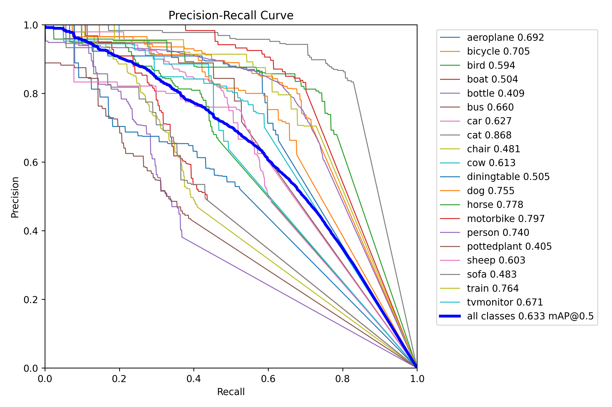
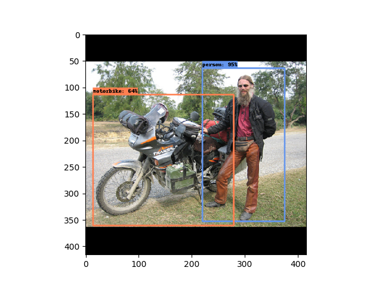

### my-yolov3

本项目实现了 YOLOv3 目标检测算法，在PASCAL VOC 2012 数据集进行训练，结果如下：  

```
+-------+-------------+---------+
| Index | Class       | AP      |
+-------+-------------+---------+
| 0     | aeroplane   | 0.69184 |
| 1     | bicycle     | 0.70512 |
| 2     | bird        | 0.59364 |
| 3     | boat        | 0.50391 |
| 4     | bottle      | 0.40909 |
| 5     | bus         | 0.65984 |
| 6     | car         | 0.62673 |
| 7     | cat         | 0.86832 |
| 8     | chair       | 0.48145 |
| 9     | cow         | 0.61252 |
| 10    | diningtable | 0.50475 |
| 11    | dog         | 0.75524 |
| 12    | horse       | 0.77794 |
| 13    | motorbike   | 0.79668 |
| 14    | person      | 0.74004 |
| 15    | pottedplant | 0.40477 |
| 16    | sheep       | 0.60292 |
| 17    | sofa        | 0.48324 |
| 18    | train       | 0.76426 |
| 19    | tvmonitor   | 0.67137 |
+-------+-------------+---------+
---- mAP 0.63268 ----  
```

  

  

### 预训练权重和数据集下载

训练模型之前，最好载入预训练权重，或者载入 Backbone 的预训练权重，不然效果很差。  

Backbone 的预训练权重使用[https://github.com/bubbliiiing/yolo3-pytorch](https://github.com/bubbliiiing/yolo3-pytorch)给出的权重。下载完权重放在项目根目录下。  

训练数据集使用 PASCAL VOC 数据集，数据集下载地址：[http://host.robots.ox.ac.uk/pascal/VOC/voc2012/VOCtrainval_11-May-2012.tar](http://host.robots.ox.ac.uk/pascal/VOC/voc2012/VOCtrainval_11-May-2012.tar)  

下载完成之后放在项目`data/`目录下。  

### 模型训练

下载得到 PASCAL VOC 数据集不是 yolo 要求的数据集格式，首先运行脚本转换格式：  

```
python trans_voc2yolo.py
```
之后会在项目根目录下生成一个`my_yolo_dataset/`目录，里面是 yolo 格式的数据集。然后执行`train.py`脚本即可对模型进行训练。  

### 模型测试

训练过程会打印相关的损失函数值以及在验证集上的效果，修改`val.py`脚本中模型的权重路径为上面训练得到的权重路径，再执行`val.py`脚本即可对模型在验证集上进行测试，默认会将 mAP 进行输出，并将相应的图表绘制在`run/`目录下。  

### 参考仓库

[https://github.com/bubbliiiing/yolo3-pytorch](https://github.com/bubbliiiing/yolo3-pytorch)
[https://github.com/eriklindernoren/PyTorch-YOLOv3](https://github.com/eriklindernoren/PyTorch-YOLOv3)
[https://github.com/WZMIAOMIAO/deep-learning-for-image-processing/tree/master/pytorch_object_detection/yolov3_spp](https://github.com/WZMIAOMIAO/deep-learning-for-image-processing/tree/master/pytorch_object_detection/yolov3_spp)